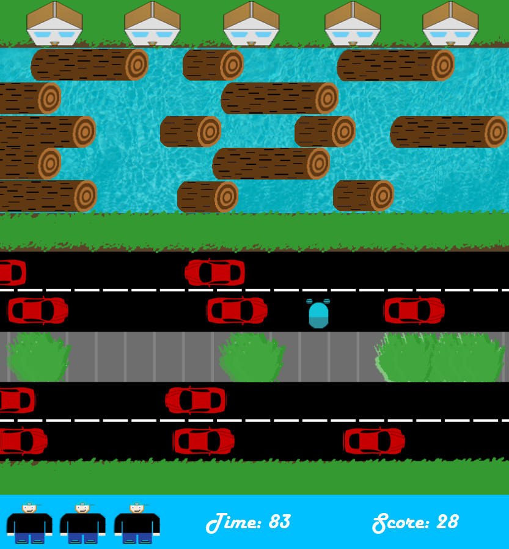

# Jogger3

IB Computer Science Internal Assessment 2017.
My first big project.
All linked data structures and algorithms are written by me. 

Frogger Style game written in C#.
I used Visual Studio's designer for the majority of the GUI work.

The player has to reach each of the houses at the top of the screen as fast as possible, while avoiding cars and using logs to get out of the water. If you run out of lives or time, the game is over.

The game has a complete menu system, high scores that save to the user's computer as text and load up when the game is played, and three difficulty levels.

Menus give access to instructions, high scores and difficulty changes.
High scores are calculated based on difficulty, progress and time taken.
Difficulty changes the time limit and the speed of the cars and logs.

The exe is included to play the game.

